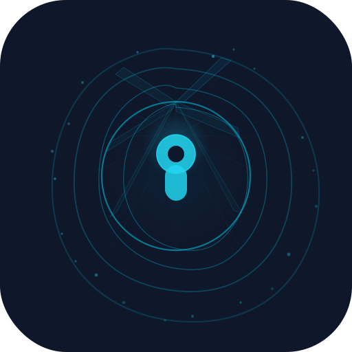

<p align="center">
  <picture>
    <source media="(prefers-color-scheme: dark)" srcset="assets/logo.svg">
    <source media="(prefers-color-scheme: light)" srcset="assets/logo-light.svg">
    
  </picture>
</p>


<h1 align="center">mk</h1>

<p align="center">
  <strong>My Keys</strong> — Minimalist API key manager for the terminal
</p>

<p align="center">
  <a href="https://github.com/axliupore/mk/releases"></a>
  <a href="https://github.com/axliupore/mk/releases"></a>
  <a href="LICENSE"></a>
  <a href="https://go.dev"></a>
  <a href="https://github.com/axliupore/mk/releases"></a>
</p>

---

## Why mk?

You have dozens of API keys scattered across `.env` files, config files, and notes. **mk** puts them all in one place — the **system Keychain** — with two-letter commands.

No config files. No databases. No cloud sync. Your keys never touch the disk.

## Features

- **🔒 System Keychain** — Keys are stored in the OS-native encrypted credential store (Keychain / Credential Manager / Secret Service)
- **⚡ Two-letter commands** — `mk set`, `mk get`, `mk cp`, `mk ls`, `mk rm` — that's the entire API
- **📋 Pipe-friendly** — `mk get` outputs pure text, no ANSI codes. Perfect for `$(mk get alias)`
- **🖥️ Cross-platform** — macOS, Linux, and Windows with a single binary
- **🎨 Beautiful output** — Styled with [lipgloss](https://github.com/charmbracelet/lipgloss), respects your terminal
- **📦 Zero dependencies** — Static binary, no runtime requirements

## Demo

```
$ mk set openai sk-proj-abc123...
  ✓  Set openai

$ mk set nvidia nvapi-xyz789...
  ✓  Set nvidia

$ mk ls
  ● nvidia
  ● openai

$ mk get openai
sk-proj-abc123...

$ curl -s -H "Authorization: Bearer $(mk get openai)" https://api.openai.com/v1/models | head -5

$ mk cp openai
  ✓  Copied openai to clipboard

$ mk rm openai
  ✓  Removed openai
```

## Install

### macOS

```bash
brew tap axliupore/tap
brew install axliupore/tap/mk
```

### Linux

Download the `.deb`, `.rpm`, or `.apk` package from [Releases](https://github.com/axliupore/mk/releases).

```bash
# Debian / Ubuntu
sudo dpkg -i mk_*_linux_amd64.deb

# Fedora / RHEL
sudo rpm -i mk_*_linux_amd64.rpm

# Alpine
sudo apk add --allow-untrusted mk_*_linux_amd64.apk
```

> **Note:** On Linux, `gnome-keyring` and `libsecret-tools` are recommended for the `ls` command.

### Windows

```powershell
scoop bucket add axliupore https://github.com/axliupore/scoop-bucket
scoop install mk
```

### From Source

Requires [Go](https://go.dev/dl/) 1.26+.

```bash
go install github.com/axliupore/mk@latest
```

## Usage

```
mk set <alias> <key>     Store a secret
mk get <alias>           Retrieve a secret (pure text, pipe-friendly)
mk cp <alias>            Copy a secret to clipboard
mk ls                    List all stored aliases
mk rm <alias>            Remove a secret
mk --version             Show version info
```

### Common Patterns

```bash
# Use directly in commands
curl -H "Authorization: Bearer $(mk get openai)" https://api.openai.com/v1/models

# Set environment variable
export ANTHROPIC_API_KEY=$(mk get anthropic)

# Copy without exposing in terminal history
mk cp openai
```

## How It Works

`mk` delegates all storage to the OS-native credential manager:

| Platform | Backend | Implementation |
|----------|---------|----------------|
| macOS | Keychain | [go-keyring](https://github.com/zalando/go-keyring) |
| Windows | Credential Manager | [wincred](https://github.com/danieljoos/wincred) |
| Linux | Secret Service | [dbus](https://github.com/godbus/dbus) (GNOME Keyring / KWallet) |

Your keys are encrypted at rest by the operating system. `mk` never writes anything to disk.

## Security

- **Encrypted storage** — Keys live inside the system's credential store, protected by your OS login
- **No disk writes** — `mk` never creates config files or writes secrets to disk
- **Clipboard safety** — `mk cp` copies directly to clipboard without printing to terminal
- **No network** — `mk` makes zero network requests. Fully offline
- **Open source** — MIT licensed, audit the code yourself

## Development

```bash
# Clone
git clone git@github.com:axliupore/mk.git
cd mk

# Build
go build -o mk .

# Install locally
go install .

# Test
go test ./...
```

## License

[MIT](LICENSE) © [axliupore](https://github.com/axliupore)
